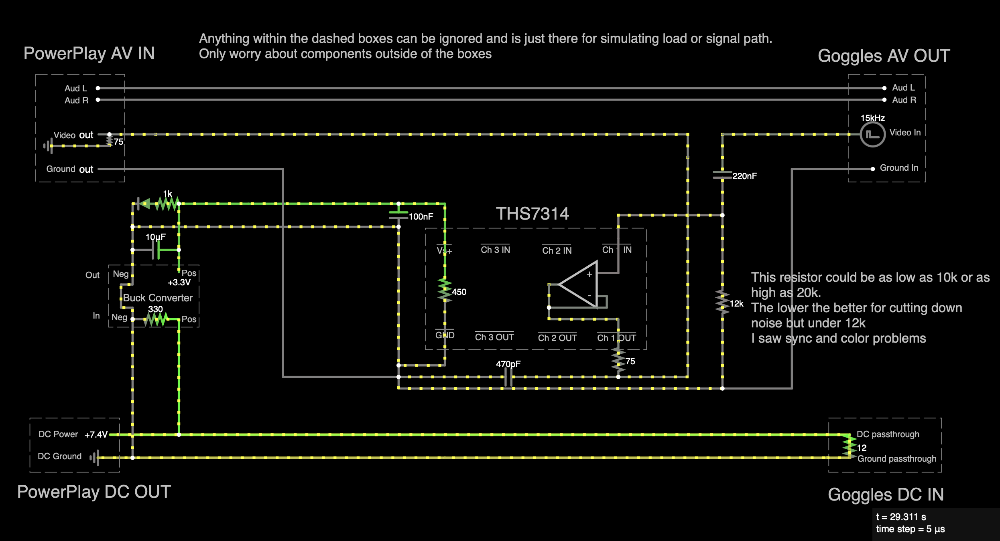

# FPV Signal Cleaner

**Clean AV Buffer Module for Fat Shark Goggles + PowerPlay DVR**

*Click the image on the right to watch the demo video!*

## 📖 Overview

The FPV Signal Cleaner is a compact inline module that cleans up the composite video signal from Fat Shark FPV goggles before it reaches a DVR (like the ImmersionRC PowerPlay). While the internal video feed remains clean, the AV output suffers from amplified noise, distortion, and flashes, especially during RF signal fluctuations.

This module uses a **THS7314 video buffer chip**, low-pass filtering, and impedance matching to condition the video signal while passing audio and power through untouched. Power is taken from the PowerPlay's 7.4–8.4V barrel output and regulated to 3.3V using a buck converter to power the buffer circuit.

Everything is mounted on perfboard and housed in a small enclosure that plugs directly into the side of the PowerPlay — like a dongle.

## 🎯 Key Features

- ✅ **Cleans and buffers composite video** signal
- ✅ **Passes audio through untouched** (or disconnects if not needed)
- ✅ **Regulates 3.3V** from PowerPlay to run the chip
- ✅ **Dual-connector dongle design** - plugs into both AV and power ports on PowerPlay
- ✅ **Compact enclosure** - 3D printed case for professional appearance
- ✅ **Impedance matching** - 75Ω resistor for proper video signal integrity

## 📋 Parts List

### 🔧 Core Components
| Qty | Item | Description | Approx. Cost |
|-----|------|-------------|--------------|
| 1 | THS7314D | 3-channel video buffer (SOIC-8) – Texas Instruments | $0.75 |
| 1 | SOIC-8 to DIP adapter | With header pins for breadboard/perfboard use | $2.88 |

### 🔋 Power Components
| Qty | Item | Description | Approx. Cost |
|-----|------|-------------|--------------|
| 1 | MP1584 buck converter module | Adjustable 3.3V regulator (input: 7.4–8.4V) | $2.50 |

### 🎥 Video Path Components
| Qty | Value | Description | Approx. Cost |
|-----|-------|-------------|--------------|
| 1 | 220nF | DC blocking cap (C0G/NP0 ceramic - **critical for video quality**) | $0.41 |
| 3 | 75Ω (1%) | Input + output matching resistors | $0.12 each |
| 1 | 470pF | Output low-pass filter cap (C0G/NP0 ceramic - **critical for video quality**) | $0.27 |
| 1 | 12kΩ | Pull-down resistor for noise suppression | $0.10 |

### ⚡ Power Filtering
| Qty | Value | Description | Approx. Cost |
|-----|-------|-------------|--------------|
| 1 | 0.1µF ceramic | THS7314 bypass cap (C0G/NP0 ceramic - **critical for video quality**) | $0.27 |
| 1 | 10µF electrolytic | Bulk cap on 3.3V rail | $0.50 |

### 🔌 Connectors
| Qty | Item | Description | Approx. Cost |
|-----|------|-------------|--------------|
| 1 | TRRS 3.5mm female jack | AV in from goggles | $0.50 |
| 1 | TRRS 3.5mm male plug | AV out to PowerPlay | $0.50 |
| 1 | 5.5x2.5mm barrel female jack | Power to goggles | $1.00 |
| 1 | 5.5x2.5mm barrel male plug | Power from PowerPlay | $0.50 |

### 🧱 Optional Materials
| Qty | Item | Use | Approx. Cost |
|-----|------|-----|--------------|
| 1 | 30x70mm perfboard (cut to 30x43mm) | Mount components | $2.00 |
| 1 | 3D-printed enclosure | Enclose the module | $5.00 |
| 1 | Heat shrink / tape / glue | Wire insulation and securing parts | $3.00 |

**Total Estimated Cost: ~$20-25 USD**

## 🔌 Pinout Information

### TRRS AV Composite Pinout (sleeve to tip):
- **Sleeve**: Ground
- **Ring 1**: Video  
- **Ring 2**: AudR
- **Tip**: AudL

**Note**: You may only care about the sleeve (Ground) and 3rd segment (Video) and can ignore the tip and 2nd segment (audio).

## 🔌 Circuit Design

*Interactive circuit simulation available: Load `hardware/AVCleanerDiagram-falstad.txt` in Falstad Circuit Simulator*

## 🛠️ Build Instructions

### 1. Circuit Assembly

1. **Mount the THS7314** on the SOIC-8 to DIP adapter
2. **Secure female TRRS jack and barrel jack** to the perfboard
3. **Secure the SOIC-8 adapter** to the perfboard
4. **Secure the buck converter** to perfboard and adjust to 3.3V output
5. **Add power filtering capacitors**:
   - 0.1µF C0G/NP0 ceramic near THS7314 VCC pin (**must be C0G/NP0 for video quality**)
   - 10µF electrolytic on 3.3V rail
6. **Install video path components**:
   - 220nF C0G/NP0 DC blocking capacitor on video input (**must be C0G/NP0 for video quality**)
   - 75Ω resistor for impedance matching (THS7314 output)
   - 470pF C0G/NP0 low-pass filter capacitor from 75Ω (video out) to ground (**must be C0G/NP0 for video quality**)
   - 12kΩ pull-down resistor from video input to ground (for noise suppression)
7. **Connect all grounds** together
8. **Wire the connectors** according to the pinout

### 2. Enclosure Assembly

1. **Print the enclosure parts** from the OnShape model
2. **Insert circuit board** inside the base
3. **Screw in and solder** TRRS jack and barrel connector
4. **Secure female barrel and TRRS** with glue or mounting hardware if desired
5. **Slide the door in** to complete the enclosure

## 📸 Build Photos

### Internal Views

### External Views

## 📁 Project Files

### 🎨 3D Models & Enclosure
- **OnShape CAD Model**: [View/Download](https://cad.onshape.com/documents/2e6892c1f7077560f1e7db3c/w/84a265bc11fc2bf27c14fb24/e/b1e7d4b621d2da3bc5834969)
- **STL Files**: Available in `enclosure/PowerPlayDongle/` directory

### 🔌 Circuit Design
- **Falstad Circuit Simulator**: Load `hardware/AVCleanerDiagram-falstad.txt` to view the interactive circuit
- **Circuit Screenshot**: `hardware/FalstadScreenshot.png`

## 🎥 Demo Video

Watch the full demonstration: [YouTube Demo](https://youtu.be/c0BqS2wPbJs?si=y3qnMJqaLPZePITY)

## 🔧 Technical Details

### Circuit Operation
The module uses a **THS7314D** 3-channel video buffer IC to:
- Buffer the incoming video signal
- Provide proper impedance matching (75Ω)
- Filter out high-frequency noise
- Maintain signal integrity

### Power Management
- **Input**: 7.4-8.4V from PowerPlay barrel connector
- **Regulation**: MP1584 buck converter to 3.3V
- **Filtering**: Multiple capacitors for clean power delivery

### Signal Path
1. **Video Input** → DC blocking cap → 75Ω resistor → THS7314 buffer
2. **Buffer Output** → 75Ω resistor → 470pF low-pass filter → Output
3. **Audio** → Passed through unchanged
4. **Power** → Regulated and filtered for IC operation

### Noise Suppression
The **12kΩ pull-down resistor** from video input to ground serves as a critical noise suppression component:
- **DC Bias Stabilization**: Provides a stable reference point for the video signal
- **White Flash Reduction**: Significantly reduces large white flashes that occur during RF signal fluctuations
- **Signal Integrity**: Helps maintain proper signal levels and prevents floating inputs
- **Optimal Value**: 12kΩ provides the best balance - lower values (10kΩ) cut more noise but can cause sync/color issues

### ⚠️ Critical Component Quality
**C0G/NP0 capacitors are essential** for this application:
- **Low Dielectric Absorption**: Prevents signal distortion and ghosting
- **Temperature Stability**: Maintains consistent performance across temperature changes
- **Video Signal Integrity**: Standard ceramic capacitors (X7R, Y5V, etc.) will cause significant video quality degradation
- **Must Use**: 220nF, 470pF, and 0.1µF capacitors must all be C0G/NP0 grade

## 📄 License

This project is licensed under a custom license - see the [LICENSE](LICENSE) file for details. This means you can:
- ✅ Use, modify, and distribute this project freely
- ✅ Build and use the device for personal, educational, or commercial purposes (paid gigs, YouTube, etc.)
- ✅ Use it in your business or for profit-generating activities
- ❌ **Cannot manufacture and sell the physical device** as your own product
- ✅ Must give appropriate credit if you share modifications
---

**Built with ❤️ for the FPV community**

*Clean signals, smooth flights!*

